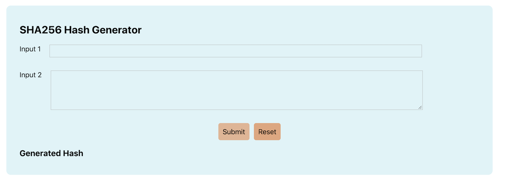
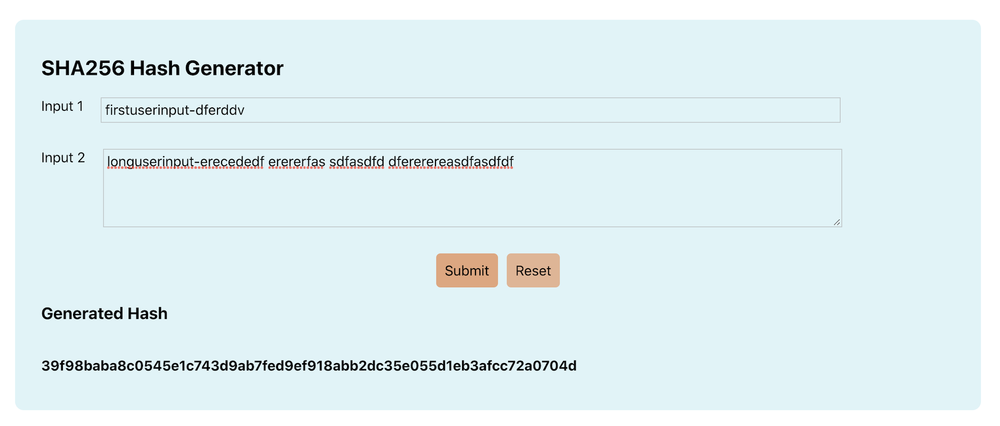

# SHA Hash Generator

This application uses the SHA256 algorithm to create a hash of the user inputs. The user inputs along with a secrete key are joined together and is used for hashing.

#### [Live DEMO](https://shucoll.github.io/SHAGenerator/)

## Examples

## Based On

[SHA256 Hash Generator JS](https://github.com/BaseMax/SHA256HashGeneratorJS)
